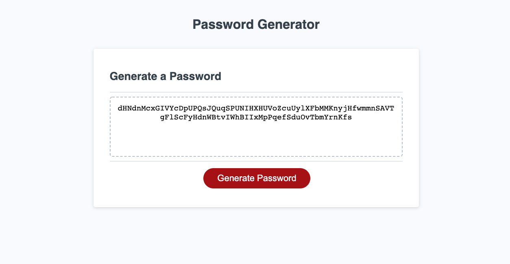

# Password Generator

### Given the requirements, I did the following:

* Allow the user to input a handful of "yes" variations on the following inputs
     * uppercase characters
     * lowercase characters
     * special characters
     * numbers
* Allow the user to input a password length between 8 and 128 (inclusive)
* Return descriptive feedback when the above criteria is not met

I did the above by using a series of prompts to determine the users wants. Then I created a randomizer by using Math.random in a for loop to iterate through the list of character's the user requested, with the number of iterations equal to the length of their password length request.

